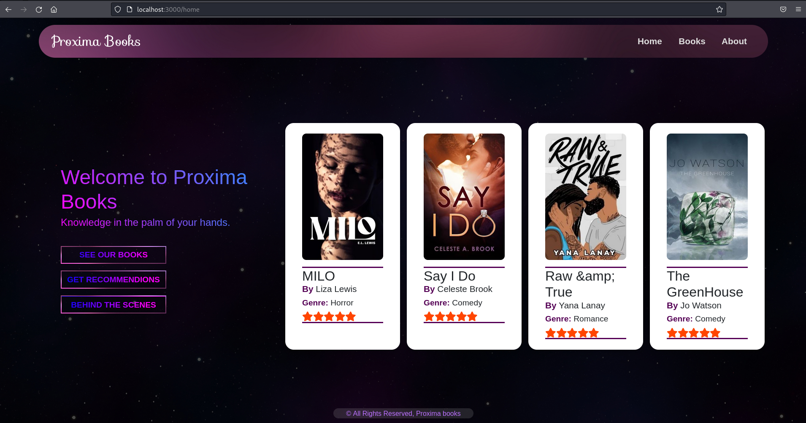
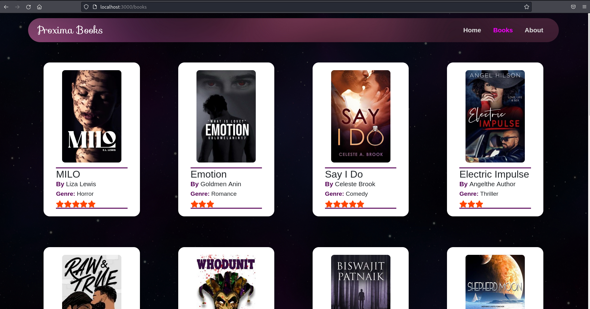
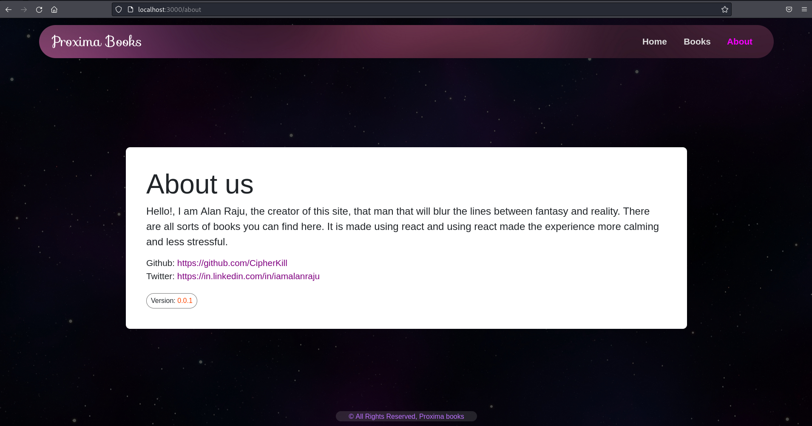

# Bookstore webpage using reactJS #

A bookstore webpage made with reactJS with facinating display and functionality.

## Contents of this README ##
- Output webpage images
- Instructions to run the project (For development and source code)
- Instructions to run the build file (for a production perspective)

## Output webpage images ##

<h3 align="center">Homepage</h3>

<h3 align="center">Bookspage</h3>

<h3 align="center">Aboutpage</h3>

## Instructions to run the project (For development and source code) ##
1.    Clone/download the project and open a terminal (cmd/bash) pointing to that directory.
2.    Run `npm install` to download all the required dependencies.
3.    Run `npm start` to run the react project.

## Instructions to run the build fle (for production perspective)##
There are many ways to do this, I will show the recommended method by react
1.    In the terminal (cmd/bash) navigate to the project directory.
2.    Run `npm install serve` to install the serve package.
3.    Run `serve -s build` to run the build file.
